---
## Front matter
title: "Отчёт по лабораторной работе №8"
subtitle: "2023"
author: "Просина Ксения Максимовна"

## Generic otions
lang: ru-RU
toc-title: "Содержание"

## Bibliography
bibliography: bib/cite.bib
csl: pandoc/csl/gost-r-7-0-5-2008-numeric.csl

## Pdf output format
toc: true # Table of contents
toc-depth: 2
lof: true # List of figures
lot: true # List of tables
fontsize: 12pt
linestretch: 1.5
papersize: a4
documentclass: scrreprt
## I18n polyglossia
polyglossia-lang:
  name: russian
  options:
	- spelling=modern
	- babelshorthands=true
polyglossia-otherlangs:
  name: english
## I18n babel
babel-lang: russian
babel-otherlangs: english
## Fonts
mainfont: PT Serif
romanfont: PT Serif
sansfont: PT Sans
monofont: PT Mono
mainfontoptions: Ligatures=TeX
romanfontoptions: Ligatures=TeX
sansfontoptions: Ligatures=TeX,Scale=MatchLowercase
monofontoptions: Scale=MatchLowercase,Scale=0.9
## Biblatex
biblatex: true
biblio-style: "gost-numeric"
biblatexoptions:
  - parentracker=true
  - backend=biber
  - hyperref=auto
  - language=auto
  - autolang=other*
  - citestyle=gost-numeric
## Pandoc-crossref LaTeX customization
figureTitle: "Рис."
tableTitle: "Таблица"
listingTitle: "Листинг"
lofTitle: "Список иллюстраций"
lotTitle: "Список таблиц"
lolTitle: "Листинги"
## Misc options
indent: true
header-includes:
  - \usepackage{indentfirst}
  - \usepackage{float} # keep figures where there are in the text
  - \floatplacement{figure}{H} # keep figures where there are in the text
---

# Цель работы

Приобретение навыков написания программ с использованием циклов и обработкой
аргументов командной строки 

# Теоретическое введение

Стек — это структура данных, организованная по принципу LIFO («Last In — First Out»
или «последним пришёл — первым ушёл»). Стек является частью архитектуры процессора и
реализован на аппаратном уровне. Для работы со стеком в процессоре есть специальные
регистры (ss, bp, sp) и команды.
Основной функцией стека является функция сохранения адресов возврата и передачи
аргументов при вызове процедур. Кроме того, в нём выделяется память для локальных
переменных и могут временно храниться значения регистров.
На рис. 8.1 показана схема организации стека в процессоре.
Стек имеет вершину, адрес последнего добавленного элемента, который хранится в ре-
гистре esp (указатель стека). Противоположный конец стека называется дном. Значение,
помещённое в стек последним, извлекается первым. При помещении значения в стек указа-
тель стека уменьшается, а при извлечении — увеличивается.
Для стека существует две основные операции:
• добавление элемента в вершину стека (push);
• извлечение элемента из вершины стека (pop).

# Выполнение лабораторной работы

## Реализация циклов в NASM

Создайте каталог для программам лабораторной работы № 8, перейдите в него и создайте
файл lab8-1.asm:
mkdir ~/work/arch-pc/lab08
cd ~/work/arch-pc/lab08
touch lab8-1.asm

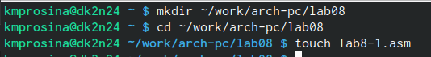{#fig:000 width=70%}

При реализации циклов в NASM с использованием инструкции loop необходимо помнить
о том, что эта инструкция использует регистр ecx в качестве счетчика и на каждом шаге
уменьшает его значение на единицу. В качестве примера рассмотрим программу, которая
выводит значение регистра ecx. Внимательно изучите текст программы (Листинг 8.1).

Листинг 8.1. Программа вывода значений регистра ecx
;-----------------------------------------------------------------
; Программа вывода значений регистра 'ecx'
;-----------------------------------------------------------------
%include 'in_out.asm' \
SECTION .data \
msg1 db 'Введите N: ',0h \
SECTION .bss \
N: resb 10 \
SECTION .text \
global _start \
_start: \
; ----- Вывод сообщения 'Введите N: '
mov eax,msg1 \
call sprint \
; ----- Ввод 'N'
mov ecx, N \
mov edx, 10 \
call sread \
; ----- Преобразование 'N' из символа в число
mov eax,N \
call atoi \
mov [N],eax \
; ------ Организация цикла
mov ecx,[N] ; Счетчик цикла, `ecx=N` \
label: \
mov [N],ecx \
mov eax,[N] \
call iprintLF ; Вывод значения `N` \
loop label ; `ecx=ecx-1` и если `ecx` не '0' \
; переход на `label` \
call quit \

Введите в файл lab8-1.asm текст программы из листинга 8.1. Создайте исполняемый файл
и проверьте его работу.

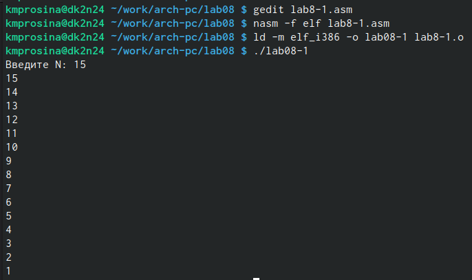{#fig:001 width=70%}

Данный пример показывает, что использование регистра ecx в теле цилка loop может
привести к некорректной работе программы. Измените текст программы добавив изменение
значение регистра ecx в цикле:
label: \
sub ecx,1 ; `ecx=ecx-1` \
mov [N],ecx \
mov eax,[N] \
call iprintLF \
loop label \

Создайте исполняемый файл и проверьте его работу. Какие значения принимает регистр
ecx в цикле? Соответствует ли число проходов цикла значению 𝑁 введенному с клавиатуры?

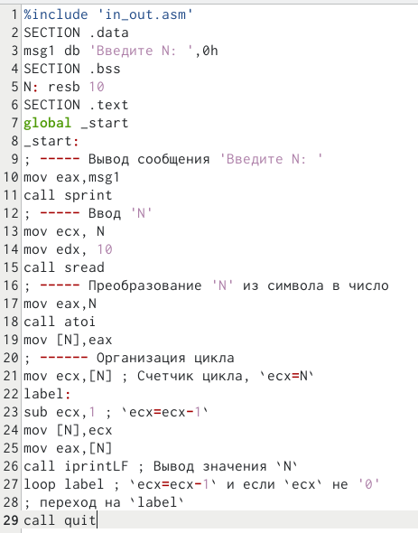{#fig:002 width=70%}

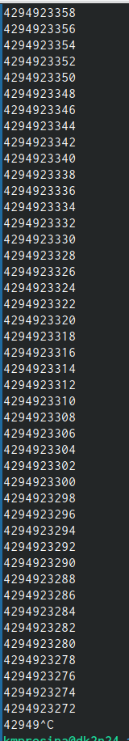{#fig:003 width=70%}

После изменения кода числа начали принимать огромные значения, а цикл стал бесконечным, поэтому его пришлось прервать. Число проходов цикла не соответствует значению Н, введенному с клавиатуры

Для использования регистра ecx в цикле и сохранения корректности работы программы
можно использовать стек. Внесите изменения в текст программы добавив команды push
и pop (добавления в стек и извлечения из стека) для сохранения значения счетчика цикла
loop: \
label: \
push ecx ; добавление значения ecx в стек \
sub ecx,1 \
mov [N],ecx \
mov eax,[N] \
call iprintLF \
pop ecx ; извлечение значения ecx из стека
loop label
Создайте исполняемый файл и проверьте его работу. Соответствует ли в данном случае
число проходов цикла значению 𝑁 введенному с клавиатуры?

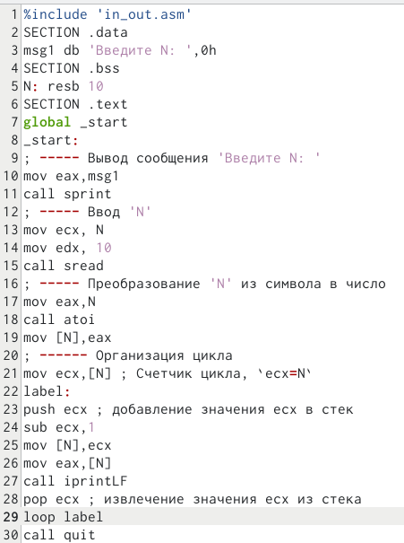{#fig:004 width=70%}

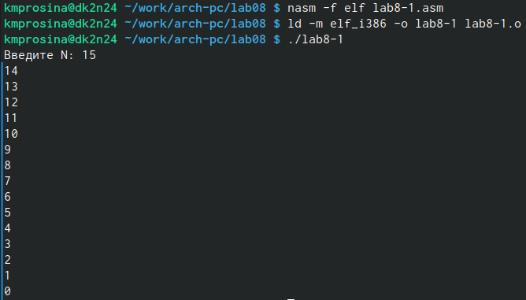{#fig:005 width=70%}

В данном случае число проходов цикла меньше на единицу введенного N

## Обработка аргументов командной строки

При разработке программ иногда встает необходимость указывать аргументы, которые
будут использоваться в программе, непосредственно из командной строки при запуске
программы.
При запуске программы в NASM аргументы командной строки загружаются в стек в обрат-
ном порядке, кроме того в стек записывается имя программы и общее количество аргументов.
Последние два элемента стека для программы, скомпилированной NASM, – это всегда имя
программы и количество переданных аргументов.
Таким образом, для того чтобы использовать аргументы в программе, их просто нужно
извлечь из стека. Обработку аргументов нужно проводить в цикле. Т.е. сначала нужно из-
влечь из стека количество аргументов, а затем циклично для каждого аргумента выполнить
логику программы. В качестве примера рассмотрим программу, которая выводит на экран
аргументы командной строки. Внимательно изучите текст программы (Листинг 8.2).
Листинг 8.2. Программа выводящая на экран аргументы командной строки
;-----------------------------------------------------------------
; Обработка аргументов командной строки
;-----------------------------------------------------------------
%include 'in_out.asm' \
SECTION .text \
global _start \
_start: \
pop ecx ; Извлекаем из стека в `ecx` количество \
; аргументов (первое значение в стеке) \
pop edx ; Извлекаем из стека в `edx` имя программы \
; (второе значение в стеке) \
sub ecx, 1 ; Уменьшаем `ecx` на 1 (количество \
; аргументов без названия программы) \
next: \
cmp ecx, 0 ; проверяем, есть ли еще аргументы \
jz _end ; если аргументов нет выходим из цикла \
; (переход на метку `_end`) \
pop eax ; иначе извлекаем аргумент из стека \
call sprintLF ; вызываем функцию печати \
loop next ; переход к обработке следующего \
; аргумента (переход на метку `next`) \
_end: \
call quit \

Создайте файл lab8-2.asm в каталоге ~/work/arch-pc/lab08 и введите в него текст про-
граммы из листинга 8.2.
Создайте исполняемый файл и запустите его, указав аргументы:
user@dk4n31:~$ ./lab8-2 аргумент1 аргумент 2 'аргумент 3'
Сколько аргументов было обработано программой?

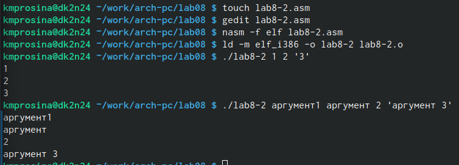{#fig:006 width=70%}

Всего было выведено 4 аргумента. Второй аргумент был зачтен как два разных, поскольку между ними стоит пробел. Чтобы сделать их единым аргументом, необходимо поставить их в кавычки, как в примере 3 аргумента

Рассмотрим еще один пример программы которая выводит сумму чисел, которые пере-
даются в программу как аргументы. Создайте файл lab8-3.asm в каталоге ~/work/arch-
pc/lab08 и введите в него текст программы из листинга 8.3.

Листинг 8.3. Программа вычисления суммы аргументов командной строки
%include 'in_out.asm' \
SECTION .data \
msg db "Результат: ",0 \
SECTION .text \
global _start \
_start: \
pop ecx ; Извлекаем из стека в `ecx` количество \
; аргументов (первое значение в стеке) \
pop edx ; Извлекаем из стека в `edx` имя программы \
; (второе значение в стеке) \
sub ecx,1 ; Уменьшаем `ecx` на 1 (количество \
; аргументов без названия программы) \
mov esi, 0 ; Используем `esi` для хранения \
; промежуточных сумм \
next: \
cmp ecx,0h ; проверяем, есть ли еще аргументы \
jz _end ; если аргументов нет выходим из цикла \
; (переход на метку `_end`) \
pop eax ; иначе извлекаем следующий аргумент из стека \
call atoi ; преобразуем символ в число \
add esi,eax ; добавляем к промежуточной сумме \
; след. аргумент `esi=esi+eax` \
loop next ; переход к обработке следующего аргумента \
_end: \
mov eax, msg ; вывод сообщения "Результат: " \
call sprint \
mov eax, esi ; записываем сумму в регистр `eax` \
call iprintLF ; печать результата \
call quit ; завершение программы \

Создайте исполняемый файл и запустите его, указав аргументы. Пример результата работы
программы:
user@dk4n31:~$ ./main 12 13 7 10 5
Результат: 47
user@dk4n31:~$

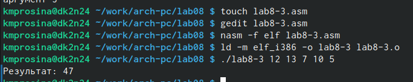{#fig:007 width=70%}

Измените текст программы из листинга 8.3 для вычисления произведения аргументов
командной строки.

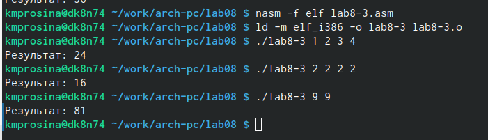{#fig:011 width=70%}

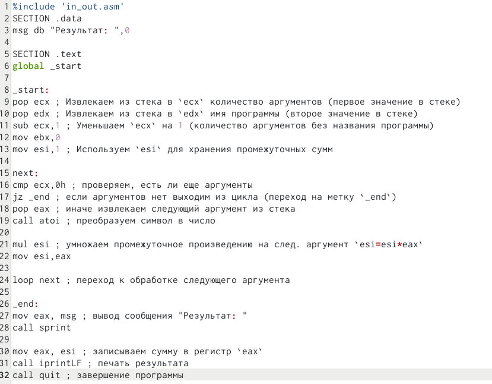{#fig:012 width=70%}

В ходе преобразований кода, мне удалось сделать так, чтобы аргументы перемножались.

mul esi \ Здесь мы умножаем промежуточное произведение на след. аргумент
mov esi,eax \ После этого мы присваиваем еси получившееся произведение, чтобы впоследствии цикл умножил его на следующий элемент.

## Задание для самостоятельной работы

1. Напишите программу, которая находит сумму значений функции 𝑓(𝑥) для
𝑥 = 𝑥1, 𝑥2, ..., 𝑥𝑛, т.е. программа должна выводить значение 𝑓(𝑥1) + 𝑓(𝑥2) + ... + 𝑓(𝑥𝑛).
Значения 𝑥𝑖 передаются как аргументы. Вид функции 𝑓(𝑥) выбрать из таблицы
8.1 вариантов заданий в соответствии с вариантом, полученным при выполнении
лабораторной работы № 7. Создайте исполняемый файл и проверьте его работу на
нескольких наборах 𝑥 = 𝑥1, 𝑥2, ..., 𝑥𝑛.
Пример работы программы для функции 𝑓(𝑥) = 𝑥 + 2 и набора 𝑥1 = 1, 𝑥2 = 2, 𝑥3 = 3,
𝑥4 = 4:
user@dk4n31:~$ ./main 1 2 3 4
Функция: f(x)=x+2
Результат: 18
user@dk4n31:~$

Моим вариантом является 19 (8x-3) согласно этой таблице:

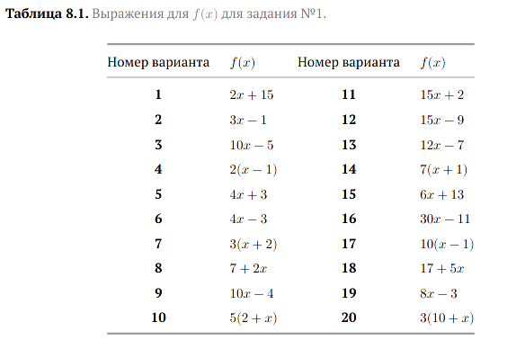{#fig:008 width=70%}

Для создания файла я использовала команду touch, а для редактирования - gedit.

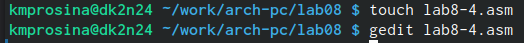{#fig:009 width=70%}

В итоге у меня получился такой код для решения:

%include 'in_out.asm' \
SECTION .data \
msg1 db "Функция: f(x)=8x-3",0 \
msg2 db "Результат: ",0 \

SECTION .text \
global _start \

_start: \
pop ecx ; Извлекаем из стека в `ecx` количество аргументов (первое значение в стеке) \
pop edx ; Извлекаем из стека в `edx` имя программы (второе значение в стеке) \
sub ecx,1 ; Уменьшаем `ecx` на 1 (количество аргументов без названия программы) \
mov esi, 0 ; Используем `esi` для хранения промежуточных сумм \

next: \
cmp ecx,0h ; проверяем, есть ли еще аргументы \
jz _end ; если аргументов нет выходим из цикла (переход на метку `_end`) \
pop eax ; иначе извлекаем следующий аргумент из стека \
call atoi ; преобразуем символ в число \

mov ebx,8 \
mul ebx \
sub eax,3 \
add esi,eax \
loop next ; переход к обработке следующего аргумента \

_end: \
mov eax, msg1 ; вывод сообщения "Функция: f(x)=8x-3: " \
call sprintLF \

mov eax, msg2 ; вывод сообщения "Результат: " \
call sprint \

mov eax, esi ; записываем итог в регистр `eax` \
call iprintLF ; печать результата \
call quit ; завершение программы \

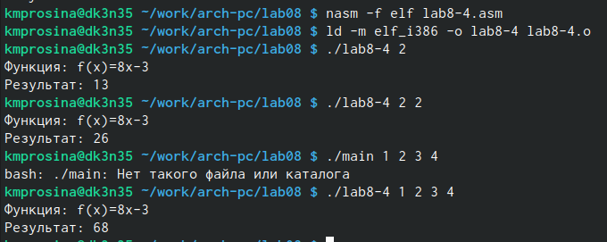{#fig:010 width=70%}

Объясню вычисление.
mov ebx,8 \ Здесь я присвоила ебкс число восемь, чтобы впоследствии с ним можно было работать
mul ebx \ Этой командой я умножила аргумент на 8
sub eax,3 \ sub позволяет вычесть из аргумента 3
add esi,eax \ далее мы добавляем к счетчику суммы функций получившийся измененный аргумент

# Выводы

Были приобретены навыки написания программ с использованием циклов и обработкой
аргументов командной строки

# Список литературы{.unnumbered}

