---
## Front matter
title: "Отчёт по лабораторной работе №9"
subtitle: "2023"
author: "Просина Ксения Максимовна"

## Generic otions
lang: ru-RU
toc-title: "Содержание"

## Bibliography
bibliography: bib/cite.bib
csl: pandoc/csl/gost-r-7-0-5-2008-numeric.csl

## Pdf output format
toc: true # Table of contents
toc-depth: 2
lof: true # List of figures
lot: true # List of tables
fontsize: 12pt
linestretch: 1.5
papersize: a4
documentclass: scrreprt
## I18n polyglossia
polyglossia-lang:
  name: russian
  options:
	- spelling=modern
	- babelshorthands=true
polyglossia-otherlangs:
  name: english
## I18n babel
babel-lang: russian
babel-otherlangs: english
## Fonts
mainfont: PT Serif
romanfont: PT Serif
sansfont: PT Sans
monofont: PT Mono
mainfontoptions: Ligatures=TeX
romanfontoptions: Ligatures=TeX
sansfontoptions: Ligatures=TeX,Scale=MatchLowercase
monofontoptions: Scale=MatchLowercase,Scale=0.9
## Biblatex
biblatex: true
biblio-style: "gost-numeric"
biblatexoptions:
  - parentracker=true
  - backend=biber
  - hyperref=auto
  - language=auto
  - autolang=other*
  - citestyle=gost-numeric
## Pandoc-crossref LaTeX customization
figureTitle: "Рис."
tableTitle: "Таблица"
listingTitle: "Листинг"
lofTitle: "Список иллюстраций"
lotTitle: "Список таблиц"
lolTitle: "Листинги"
## Misc options
indent: true
header-includes:
  - \usepackage{indentfirst}
  - \usepackage{float} # keep figures where there are in the text
  - \floatplacement{figure}{H} # keep figures where there are in the text
---

# Цель работы

Приобретение навыков написания программ с использованием подпрограмм. Знакомство
с методами отладки при помощи GDB и его основными возможностями

# Теоретическое введение

## Понятие об отладке

Отладка — это процесс поиска и исправления ошибок в программе. В общем случае его
можно разделить на четыре этапа:
• обнаружение ошибки;
• поиск её местонахождения;
• определение причины ошибки;
• исправление ошибки.
Можно выделить следующие типы ошибок:
• синтаксические ошибки — обнаруживаются во время трансляции исходного кода и
вызваны нарушением ожидаемой формы или структуры языка;
• семантические ошибки — являются логическими и приводят к тому, что программа
запускается, отрабатывает, но не даёт желаемого результата;
• ошибки в процессе выполнения — не обнаруживаются при трансляции и вызывают пре-
рывание выполнения программы (например, это ошибки, связанные с переполнением
или делением на ноль).
Второй этап — поиск местонахождения ошибки. Некоторые ошибки обнаружить доволь-
но трудно. Лучший способ найти место в программе, где находится ошибка, это разбить
программу на части и произвести их отладку отдельно друг от друга.
Третий этап — выяснение причины ошибки. После определения местонахождения ошибки
обычно проще определить причину неправильной работы программы.
Последний этап — исправление ошибки. После этого при повторном запуске программы,
может обнаружиться следующая ошибка, и процесс отладки начнётся заново

# Выполнение лабораторной работы

## Реализация подпрограмм в NASM
1. Создайте каталог для выполнения лабораторной работы No 9, перейдите в него и со-
здайте файл lab09-1.asm:
mkdir ~/work/arch-pc/lab09
cd ~/work/arch-pc/lab09
touch lab09-1.asm

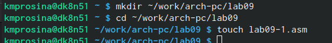{#fig:000 width=70%}

2. В качестве примера рассмотрим программу вычисления арифметического выражения
𝑓(𝑥) = 2𝑥 + 7 с помощью подпрограммы _calcul. В данном примере 𝑥 вводится с
клавиатуры, а само выражение вычисляется в подпрограмме. Внимательно изучите
текст программы (Листинг 9.1).

Листинг 9.1. Пример программы с использованием вызова подпрограммы

%include 'in_out.asm' \
SECTION .data \
msg: DB 'Введите x: ',0 \
result: DB '2x+7=',0 \
SECTION .bss \
x: RESB 80 \
res: RESB 80 \
SECTION .text \
GLOBAL _start \
_start: \
;------------------------------------------
; Основная программа
;------------------------------------------
mov eax, msg \
call sprint \
mov ecx, x \
mov edx, 80 \
call sread \
mov eax,x \
call atoi \
call _calcul ; Вызов подпрограммы _calcul \
mov eax,result \
call sprint \
mov eax,[res] \
call iprintLF \
call quit \
;------------------------------------------
; Подпрограмма вычисления \
; выражения "2x+7" \
_calcul: \
mov ebx,2 \
mul ebx \
add eax,7 \
mov [res],eax \
ret ; выход из подпрограммы \

Первые строки программы отвечают за вывод сообщения на экран (call sprint), чтение
данных введенных с клавиатуры (call sread) и преобразования введенных данных из
символьного вида в численный (call atoi). После следующей инструкции call _calcul, которая передает управление подпрограмме _calcul, будут выполнены инструкции подпрограммы

Инструкция ret является последней в подпрограмме и ее исполнение приводит к воз-
вращению в основную программу к инструкции, следующей за инструкцией call, которая
вызвала данную подпрограмму.
Последние строки программы реализую вывод сообщения (call sprint), результата вы-
числения (call iprintLF) и завершение программы (call quit).
Введите в файл lab09-1.asm текст программы из листинга 9.1. Создайте исполняемый
файл и проверьте его работу.

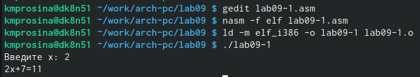{#fig:001 width=70%}

С помощью команды gedit я отредактировала файл и вставила в него код из листинга. Далее я скомпилировала файл и проверила его работу

Измените текст программы, добавив подпрограмму _subcalcul в подпрограмму _calcul,
для вычисления выражения 𝑓(𝑔(𝑥)), где 𝑥 вводится с клавиатуры, 𝑓(𝑥) = 2𝑥 + 7, 𝑔(𝑥) =
3𝑥 − 1. Т.е. 𝑥 передается в подпрограмму _calcul из нее в подпрограмму _subcalcul, где
вычисляется выражение 𝑔(𝑥), результат возвращается в _calcul и вычисляется выражение
𝑓(𝑔(𝑥)). Результат возвращается в основную программу для вывода результата на экран.

9.4.2. Отладка программам с помощью GDB
Создайте файл lab09-2.asm с текстом программы из Листинга 9.2. (Программа печати
сообщения Hello world!):

Листинг 9.2. Программа вывода сообщения Hello world!
SECTION .data \
msg1: db "Hello, ",0x0 \
msg1Len: equ $ - msg1 \
msg2: db "world!",0xa \
msg2Len: equ $ - msg2 \
SECTION .text \
global _start \
_start: \
mov eax, 4 \
mov ebx, 1 \
mov ecx, msg1 \
mov edx, msg1Len \
int 0x80 \
mov eax, 4 \
mov ebx, 1 \
mov ecx, msg2 \
mov edx, msg2Len \
int 0x80 \
mov eax, 1 \
mov ebx, 0 \
int 0x80 \

Получите исполняемый файл. Для работы с GDB в исполняемый файл необходимо добавить
отладочную информацию, для этого трансляцию программ необходимо проводить с ключом
‘-g’.
nasm -f elf -g -l lab09-2.lst lab09-2.asm
ld -m elf_i386 -o lab09-2 lab09-2.o

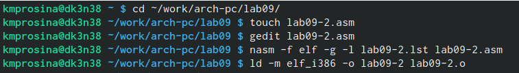{#fig:002 width=70%}

Загрузите исполняемый файл в отладчик gdb:
user@dk4n31:~$ gdb lab09-2
Проверьте работу программы, запустив ее в оболочке GDB с помощью команды run (со-
кращённо r):
(gdb) run
Starting program: ~/work/arch-pc/lab09/lab09-2
Hello, world!
[Inferior 1 (process 10220) exited normally]
(gdb)

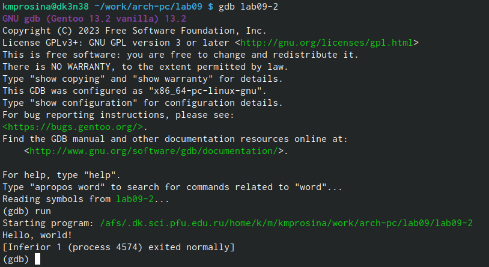{#fig:003 width=70%}

Для более подробного анализа программы установите брейкпоинт на метку _start, с
которой начинается выполнение любой ассемблерной программы, и запустите её.
(gdb) break _start
Breakpoint 1 at 0x8049000: file lab09-2.asm, line 12.
(gdb) run
Starting program: ~/work/arch-pc/lab09/lab09-2
Breakpoint 1, _start () at lab09-2.asm:12
12 mov eax, 4

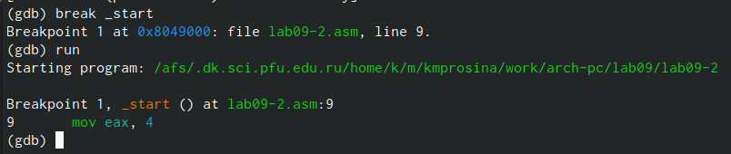{#fig:004 width=70%}

Посмотрите дисассимилированный код программы с помощью команды disassemble
начиная с метки _start
(gdb) disassemble _start

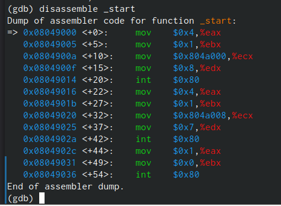{#fig:005 width=70%}

Переключитесь на отображение команд с Intel’овским синтаксисом, введя команду set
disassembly-flavor intel
(gdb) set disassembly-flavor intel
(gdb) disassemble _start

{#fig:006 width=70%}

Перечислите различия отображения синтаксиса машинных команд в режимах ATT и Intel.
Включите режим псевдографики для более удобного анализа программы (рис. 9.2):
(gdb) layout asm
(gdb) layout regs

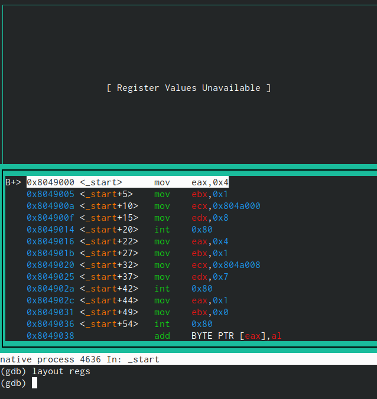{#fig:007 width=70%}

В этом режиме есть три окна:
• В верхней части видны названия регистров и их текущие значения;
• В средней части виден результат дисассимилирования программы;
• Нижняя часть доступна для ввода команд.

## Добавление точек останова

Установить точку останова можно командой break (кратко b). Типичный аргумент этой
команды — место установки. Его можно задать или как номер строки программы (имеет
смысл, если есть исходный файл, а программа компилировалась с информацией об отладке),
или как имя метки, или как адрес. Чтобы не было путаницы с номерами, перед адресом
ставится «звёздочка»:
На предыдущих шагах была установлена точка останова по имени метки (_start). Про-
верьте это с помощью команды info breakpoints (кратко i b):
(gdb) info breakpoints

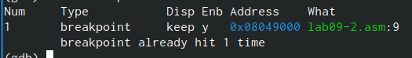{#fig:008 width=70%}

Установим еще одну точку останова по адресу инструкции. Адрес инструкции можно
увидеть в средней части экрана в левом столбце соответствующей инструкции (см. рис. 9.3).
Определите адрес предпоследней инструкции (mov ebx,0x0) и установите точку останова.
(gdb) break *<адрес>
Посмотрите информацию о всех установленных точках останова:
(gdb) i b

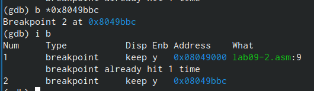{#fig:009 width=70%}

## Работа с данными программы в GDB

Отладчик может показывать содержимое ячеек памяти и регистров, а при необходимости
позволяет вручную изменять значения регистров и переменных.
Выполните 5 инструкций с помощью команды stepi (или si) и проследите за изменением
значений регистров. Значения каких регистров изменяются?
Посмотреть содержимое регистров также можно с помощью команды info registers
(или i r).
(gdb) info registers

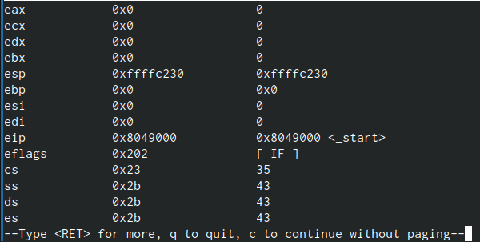{#fig:010 width=70%}

Для отображения содержимого памяти можно использовать команду x <адрес>, которая
выдаёт содержимое ячейки памяти по указанному адресу. Формат, в котором выводятся
данные, можно задать после имени команды через косую черту: x/NFU <адрес>.
С помощью команды x &<имя переменной> также можно посмотреть содержимое пере-
менной.
Посмотрите значение переменной msg1 по имени
(gdb) x/1sb &msg1
0x804a000 <msg1>: "Hello, "

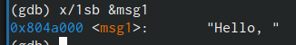{#fig:011 width=70%}

Посмотрите значение переменной msg2 по адресу. Адрес переменной можно определить
по дизассемблированной инструкции. Посмотрите инструкцию mov ecx,msg2 которая запи-
сывает в регистр ecx адрес перемененной msg2 (рис. 9.4).

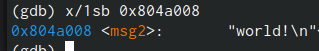{#fig:012 width=70%}

Изменить значение для регистра или ячейки памяти можно с помощью команды set,
задав ей в качестве аргумента имя регистра или адрес. При этом перед именем регистра
ставится префикс $, а перед адресом нужно указать в фигурных скобках тип данных (раз-
мер сохраняемого значения; в качестве типа данных можно использовать типы языка Си).
Измените первый символ переменной msg1 (рис. 9.5):
(gdb) set {char}msg1='h'
(gdb) x/1sb &msg1
0x804a000 <msg1>: "hello, "
(gdb)

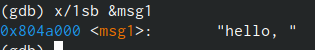{#fig:013 width=70%}

Замените любой символ во второй переменной msg2.

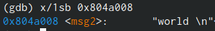{#fig:014 width=70%}

Чтобы посмотреть значения регистров используется команда print /F <val> (перед име-
нем регистра обязательно ставится префикс $) (рис. 9.6):
p/F $<регистр>
Выведете в различных форматах (в шестнадцатеричном формате, в двоичном формате и
в символьном виде) значение регистра edx.
С помощью команды set измените значение регистра ebx:
(gdb) set $ebx='2'
(gdb) p/s $ebx
$3 = 50
(gdb) set $ebx=2
(gdb) p/s $ebx
$4 = 2

## Обработка аргументов командной строки в GDB

Скопируйте файл lab8-2.asm, созданный при выполнении лабораторной работы No8,
с программой выводящей на экран аргументы командной строки (Листинг 8.2) в файл с
именем lab09-3.asm:
cp ~/work/arch-pc/lab08/lab8-2.asm ~/work/arch-pc/lab09/lab09-3.asm

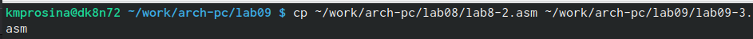{#fig:015 width=70%}

Создайте исполняемый файл.
nasm -f elf -g -l lab09-3.lst lab09-3.asm
ld -m elf_i386 -o lab09-3 lab09-3.o

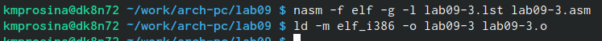{#fig:016 width=70%}

Для загрузки в gdb программы с аргументами необходимо использовать ключ --args.
Загрузите исполняемый файл в отладчик, указав аргументы:
gdb --args lab09-3 аргумент1 аргумент 2 'аргумент 3'

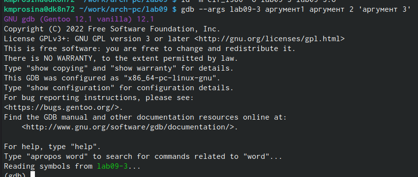{#fig:017 width=70%}

Как отмечалось в предыдущей лабораторной работе, при запуске программы аргументы
командной строки загружаются в стек. Исследуем расположение аргументов командной
строки в стеке после запуска программы с помощью gdb.
Для начала установим точку останова перед первой инструкцией в программе и запустим
ее.
(gdb) b _start
(gdb) run

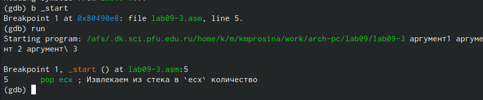{#fig:018 width=70%}

Адрес вершины стека храниться в регистре esp и по этому адресу располагается число
равное количеству аргументов командной строки (включая имя программы):
(gdb) x/x $esp
0xffffd200: 0x05

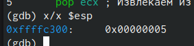{#fig:019 width=70%}

Как видно, число аргументов равно 5 – это имя программы lab09-3 и непосредственно
аргументы: аргумент1, аргумент, 2 и 'аргумент 3'.
Посмотрите остальные позиции стека – по адесу [esp+4] располагается адрес в памяти
где находиться имя программы, по адесу [esp+8] храниться адрес первого аргумента, по
аресу [esp+12] – второго и т.д.

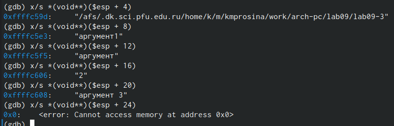{#fig:020 width=70%}

Объясните, почему шаг изменения адреса равен 4 ([esp+4], [esp+8], [esp+12] и т.д.).

## Задание для самостоятельной работы

1. Преобразуйте программу из лабораторной работы No8 (Задание No1 для самостоятель-
ной работы), реализовав вычисление значения функции 𝑓(𝑥) как подпрограмму.

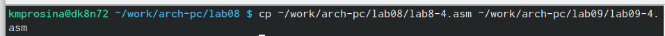{#fig:021 width=70%}

Сначала я скопировала файл с помощью команды cp

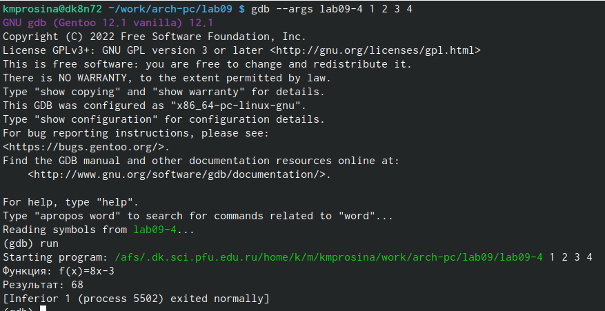{#fig:022 width=70%}

Далее, используя уже изученные команды, мне удалось выолнить задачу

2. В листинге 9.3 приведена программа вычисления выражения (3 + 2) ∗ 4 + 5. При запуске
данная программа дает неверный результат. Проверьте это. С помощью отладчика GDB,
анализируя изменения значений регистров, определите ошибку и исправьте ее.
Листинг 9.3. Программа вычисления выражения (3 + 2) ∗ 4 + 5
%include 'in_out.asm' \
SECTION .data \
div: DB 'Результат: ',0 \
SECTION .text \
GLOBAL _start \
_start: \
; ---- Вычисление выражения (3+2)*4+5 \
mov ebx,3 \
mov eax,2 \
add ebx,eax \
mov ecx,4 \
mul ecx \
add ebx,5 \
mov edi,ebx \
; ---- Вывод результата на экран \
mov eax,div \
call sprint \
mov eax,edi \
call iprintLF \
call quit \

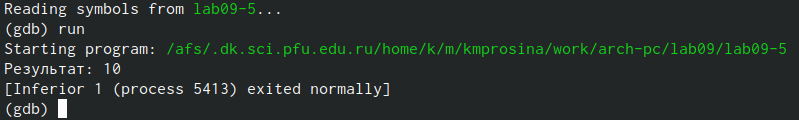{#fig:023 width=70%}

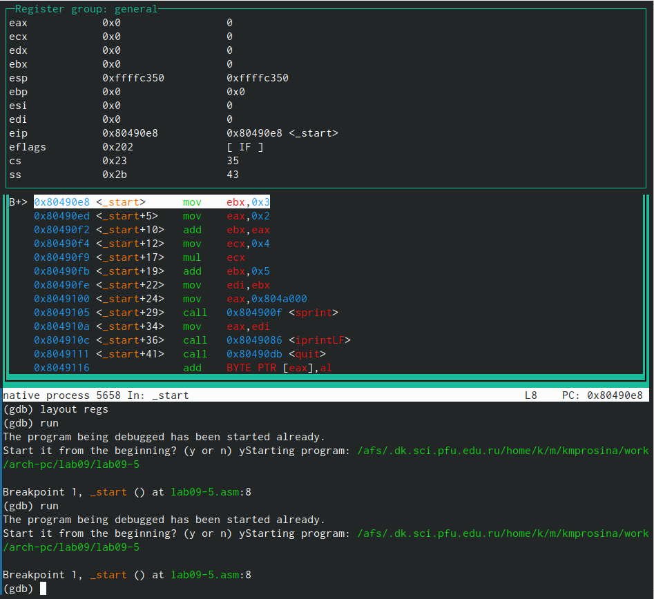{#fig:024 width=70%}

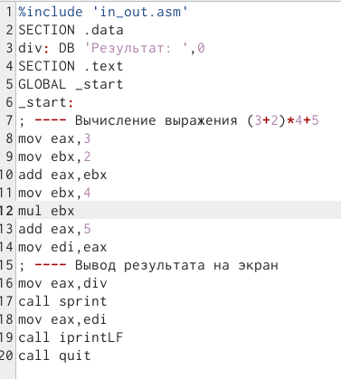{#fig:025 width=70%}

Итоговый код получился таким:

%include 'in_out.asm' \
SECTION .data \
div: DB 'Результат: ',0 \
SECTION .text \
GLOBAL _start \
_start: \
; ---- Вычисление выражения (3+2)*4+5 \
mov eax,3 \ Главным числом я сделала eax
mov ebx,2 \ Вторым числом сделала ebx
add eax,ebx \ Добавила к eax ebx 
mov ebx,4 \ Далее я перезаписала ebx, чтобы не использовать новые переменные
mul ebx \ Умножила eax на ebx
add eax,5 \ Добавила к eax 5 и получила нужный результат!
mov edi,eax \
; ---- Вывод результата на экран \
mov eax,div \
call sprint \
mov eax,edi \
call iprintLF \
call quit \

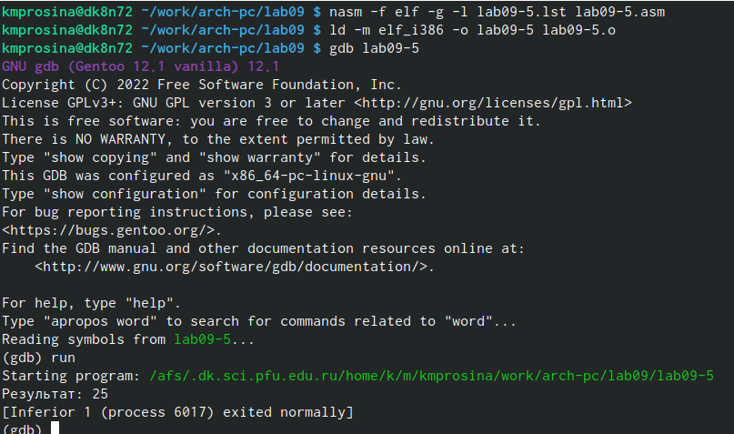{#fig:026 width=70%}

# Выводы

В ходе выполнения работы были приобретены навыки написания программ с использованием подпрограмм. Познакомились с методами отладки при помощи GDB и его основными возможностями

# Список литературы{.unnumbered}
https://esystem.rudn.ru/pluginfile.php/2089671/mod_resource/content/0/%D0%9B%D0%B0%D0%B1%D0%BE%D1%80%D0%B0%D1%82%D0%BE%D1%80%D0%BD%D0%B0%D1%8F%20%D1%80%D0%B0%D0%B1%D0%BE%D1%82%D0%B0%20%E2%84%969.%20%D0%9F%D0%BE%D0%BD%D1%8F%D1%82%D0%B8%D0%B5%20%D0%BF%D0%BE%D0%B4%D0%BF%D1%80%D0%BE%D0%B3%D1%80%D0%B0%D0%BC%D0%BC%D1%8B.%20%D0%9E%D1%82%D0%BB%D0%B0%D0%B4%D1%87%D0%B8%D0%BA%20..pdf
