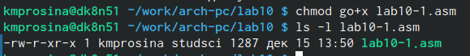

---
## Front matter
title: "Отчёт по лабораторной работе №10"
subtitle: "2023"
author: "Просина Ксения Максимовна"

## Generic otions
lang: ru-RU
toc-title: "Содержание"

## Bibliography
bibliography: bib/cite.bib
csl: pandoc/csl/gost-r-7-0-5-2008-numeric.csl

## Pdf output format
toc: true # Table of contents
toc-depth: 2
lof: true # List of figures
lot: true # List of tables
fontsize: 12pt
linestretch: 1.5
papersize: a4
documentclass: scrreprt
## I18n polyglossia
polyglossia-lang:
  name: russian
  options:
	- spelling=modern
	- babelshorthands=true
polyglossia-otherlangs:
  name: english
## I18n babel
babel-lang: russian
babel-otherlangs: english
## Fonts
mainfont: PT Serif
romanfont: PT Serif
sansfont: PT Sans
monofont: PT Mono
mainfontoptions: Ligatures=TeX
romanfontoptions: Ligatures=TeX
sansfontoptions: Ligatures=TeX,Scale=MatchLowercase
monofontoptions: Scale=MatchLowercase,Scale=0.9
## Biblatex
biblatex: true
biblio-style: "gost-numeric"
biblatexoptions:
  - parentracker=true
  - backend=biber
  - hyperref=auto
  - language=auto
  - autolang=other*
  - citestyle=gost-numeric
## Pandoc-crossref LaTeX customization
figureTitle: "Рис."
tableTitle: "Таблица"
listingTitle: "Листинг"
lofTitle: "Список иллюстраций"
lotTitle: "Список таблиц"
lolTitle: "Листинги"
## Misc options
indent: true
header-includes:
  - \usepackage{indentfirst}
  - \usepackage{float} # keep figures where there are in the text
  - \floatplacement{figure}{H} # keep figures where there are in the text
---

# Цель работы

Приобретение навыков написания программ для работы с файлами

# Теоретическое введение

ОС GNU/Linux является многопользовательской операционной системой. И для обеспече-
ния защиты данных одного пользователя от действий других пользователей существуют
специальные механизмы разграничения доступа к файлам. Кроме ограничения доступа, дан-
ный механизм позволяет разрешить другим пользователям доступ данным для совместной
работы.
Права доступа определяют набор действий (чтение, запись, выполнение), разрешённых
для выполнения пользователям системы над файлами. Для каждого файла пользователь
может входить в одну из трех групп: владелец, член группы владельца, все остальные. Для
каждой из этих групп может быть установлен свой набор прав доступа. Владельцем файла
является его создатель. Для предоставления прав доступа другому пользователю или другой
группе командой
chown [ключи] <новый_пользователь>[:новая_группа] <файл>
или
chgrp [ключи] < новая_группа > <файл>
Набор прав доступа задается тройками битов и состоит из прав на чтение, запись и ис-
полнение файла. В символьном представлении он имеет вид строк rwx, где вместо любого
символа может стоять дефис. Всего возможно 8 комбинаций, приведенных в таблице 10.1.
Буква означает наличие права (установлен в единицу второй бит триады r — чтение, первый
бит w — запись, нулевой бит х — исполнение), а дефис означает отсутствие права (нулевое
значение соответствующего бита). Также права доступа могут быть представлены как вось-
меричное число. Так, права доступа rw- (чтение и запись, без исполнения) понимаются как
три двоичные цифры 110 или как восьмеричная цифра 6

{#fig:000 width=70%}

Полная строка прав доступа в символьном представлении имеет вид:
<права_владельца> <права_группы> <права_остальных>
Так, например, права rwx r-x --x выглядят как двоичное число 111 101 001, или вось-
меричное 751.
Свойства (атрибуты) файлов и каталогов можно вывести на терминал с помощью команды
ls с ключом -l. Так например, чтобы узнать права доступа к файлу README можно узнать с
помощью следующей команды:
$ls -l /home/debugger/README
-rwxr-xr-- 1 debugger users 0 Feb 14 19:08 /home/debugger/README

# Выполнение лабораторной работы

1. Создайте каталог для программам лабораторной работы № 10, перейдите в него и
создайте файлы lab10-1.asm, readme-1.txt и readme-2.txt:
mkdir ~/work/arch-pc/lab09
cd ~/work/arch-pc/lab09
touch lab10-1.asm readme-1.txt readme-2.txt

{#fig:001 width=70%}

2. Введите в файл lab10-1.asm текст программы из листинга 10.1 (Программа записи в
файл сообщения). Создайте исполняемый файл и проверьте его работу.

{#fig:002 width=70%}

3. С помощью команды chmod измените права доступа к исполняемому файлу lab10-1,
запретив его выполнение. Попытайтесь выполнить файл. Объясните результат.

{#fig:003 width=70%}

С помощью chmod 000 lab10-1 я запретила выполнение файла абсолютно для всех. Первый ноль запретил взаимодействие с файлом владельцу, второй - группе, а третий - другим. В итоге при попытке выполнения вышел текст, повествующий о том, что выполнить комманду невозможно из-за отсутствие к нему доступа. 

4. С помощью команды chmod измените права доступа к файлу lab10-1.asm с исходным
текстом программы, добавив права на исполнение. Попытайтесь выполнить его и
объясните результат.

{#fig:004 width=70%}

С помощью chmod go+x lab10-1.asm я дала файлу возможность исполнения

5. В соответствии с вариантом в таблице предоставить права доступа к файлу readme-
1.txt представленные в символьном виде, а для файла readme-2.txt – в двочном виде.
Проверить правильность выполнения с помощью команды ls -l

Мой вариант - 19. Следовательно, мне необходимо сделать rw- rwx r-x 111 111 001

{#fig:005 width=70%}

С помощью новых кодов я смогла выполнить задачу. u значит, что я редактирую права создателя, o - права других. x - право на исполнение, w - право на запись

{#fig:006 width=70%}

Похожее есть и в двоичном коде. 7 значит 111 в двоичном коде => чтение, запись и исполнение доступны. 1 - 001 в двоичном коде. Он значит, что доступно только право на исполнение.

## Задание для самостоятельной работы

1) Напишите программу, работающую по следующему алгоритму

{#fig:009 width=70%}

Создать исполняемый файл и проверить работу. Проверить наличие файла и его содержимое с помощью ls и cat

{#fig:007 width=70%}

{#fig:008 width=70%}

# Выводы

В ходе работы были приобретены навыки написания программ для работы с файлами и изменение их прав

# Список литературы{.unnumbered}

